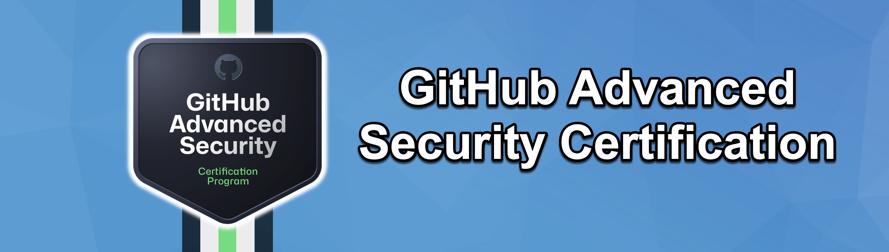

# GitHub Advanced Security Certification Guide
Highlight your code security knowledge with the GitHub Advanced Security certification. Validate your expertise in vulnerability identification, workflow security, and robust security implementation—elevating software integrity standards.

## Skills measured:

* [Domain 1: Describe the GHAS security features and functionality](./Domain%201:%20Describe%20the%20GHAS%20security%20features%20and%20functionality/guide.md) (10%)
* [Domain 2: Configure and use secret scanning](./Domain%202:%20Configure%20and%20use%20secret%20scanning/guide.md) (10%)
* [Domain 3: Configure and use dependency management](./Domain%203:%20Configure%20and%20use%20dependency%20management/guide.md) (15%)
* [Domain 4: Configure and use code scanning](./Domain%204:%20Configure%20and%20use%20code%20scanning/guide.md) (15%)
* [Domain 5: Use code scanning with CodeQL](./Domain%205:%20Use%20code%20scanning%20with%20CodeQL/guide.md) (20%)
* [Domain 6: Describe GitHub Advanced Security best practices](./Domain%206:%20Describe%20GitHub%20Advanced%20Security%20best%20practices/guide.md) (20%)
* [Domain 7: Configure GitHub Advanced Security tools in GitHub Enterprise](./Domain%207:%20Configure%20GitHub%20Advanced%20Security%20tools%20in%20GitHub%20Enterprise/guide.md) (10%)

## [Official Exam Website](https://resources.github.com/learn/certifications/)

## [Official Exam Study Guide](chrome-extension://efaidnbmnnnibpcajpcglclefindmkaj/https://assets.ctfassets.net/wfutmusr1t3h/4WQrNeENScZlISZKdknVbK/5ef56a63ec9656c6fc1c4597f4e95bc9/github-advanced-security-exam-preparation-study-guide__2_.pdf)

## GitHub Advanced Security Practice Exam --> COMING SOON!